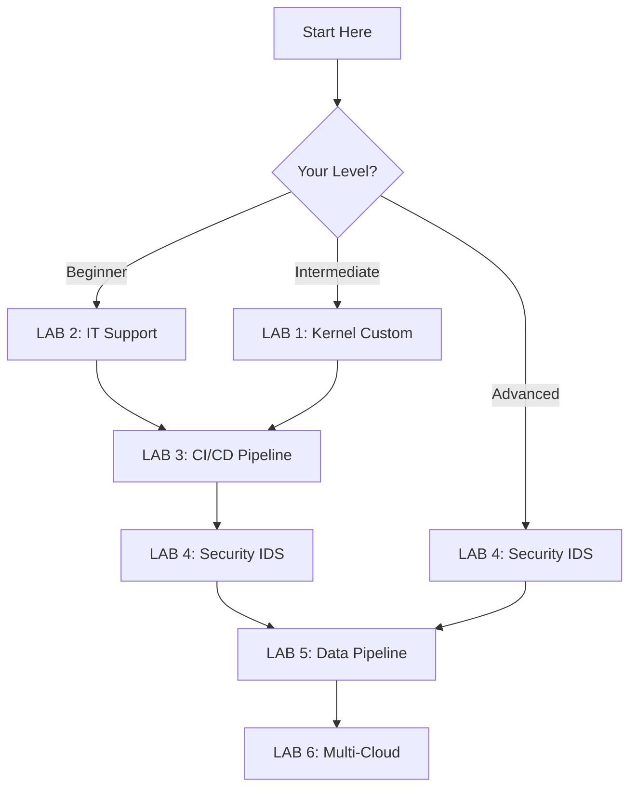

# 🐧 Linux Labs - Professional System Administration & DevOps Training

<div align="center">


**Complete hands-on Linux training path from basics to enterprise architecture**

</div>

## 📋 Navigation

<div align="center">

[](#-about-this-repository)
[](#-labs-overview)
[](#-getting-started)
[](#️-prerequisites)
[](#️-learning-roadmap)
[](#-additional-resources)
[](#-contributing)

</div>

---

## 📖 About This Repository

This repository contains a comprehensive collection of **6 professional Linux labs** designed to take you from foundational Linux administration to advanced enterprise architectures. Each lab is a complete, hands-on project that builds real-world skills used by DevOps engineers, system administrators, and cloud architects.

### 🎯 What You'll Learn
- **System Administration**: Custom kernel compilation, automation, monitoring
- **IT Support**: Hardware troubleshooting, networking, ticketing systems
- **DevOps Pipeline**: CI/CD automation with Python and enterprise tools
- **Cybersecurity**: Intrusion detection, vulnerability analysis, security hardening
- **Data Engineering**: Full-stack ETL pipelines with modern analytics platforms
- **Cloud Architecture**: Multi-cloud infrastructure with Terraform and microservices

### 💼 Aligned with Industry Certifications
Each lab maps to professional certifications from:
- 🎓 **Google**: IT Support, IT Automation, Cybersecurity, Data Analytics
- 🔷 **IBM**: DevOps, Cloud, Full Stack Development, Data Engineering
- 🟦 **Microsoft**: Azure Security, Cybersecurity Analyst
- 🐍 **Python Institute**: Python Programming Certifications
- 🔒 **(ISC)²**: CISSP preparation materials
- ☁️ **Linux Foundation**: LFD103, LFCA, CKA preparation

---

## 🧪 Labs Overview

### 📂 LAB 1: Sistema de Administración Linux con Automatización y Kernel Customizado
**Level**: 🔴 Advanced | **Duration**: ~12 hours | **Status**: ✅ Complete

<details>
<summary><b>🔍 View Lab 1 Details</b></summary>

#### What You'll Build
- Custom Linux Kernel 6.6.8 compiled from source
- Custom kernel module for system monitoring
- Automated backup system with verification
- Real-time performance monitoring dashboard
- Complete security hardening setup

#### Skills Gained
- Kernel compilation and optimization
- Kernel module development in C
- Bash scripting for automation
- Python monitoring applications
- Security configuration (fail2ban, auditd, AppArmor)

#### Prerequisites
- Basic Linux command line
- Understanding of shell scripting
- Familiarity with C programming (basic)

#### Certification Alignment
- 📘 LFD103: A Beginner's Guide to Linux Kernel Development
- 📗 LFS101: Introduction to Linux
- 📙 Linux Essentials
- 📕 Linux Unhatched (versión más básica)

[📂 Go to Lab 1](./lab1-kernel-customization/)

</details>

---

### 📂 LAB 2: Centro de Soporte IT Completo con Sistema de Tickets y Diagnóstico
**Level**: 🟡 Intermediate | **Duration**: ~10 hours | **Status**: 🚧 In Progress

<details>
<summary><b>🔍 View Lab 2 Details</b></summary>

#### What You'll Build
- IT support ticketing system
- Hardware diagnostics automation
- Network troubleshooting toolkit
- Documentation and knowledge base
- Remote support infrastructure

#### Skills Gained
- IT support best practices
- Hardware troubleshooting
- Network diagnostics
- Customer service workflows
- Documentation systems

#### Prerequisites
- Basic Linux administration
- Understanding of networking concepts
- Hardware fundamentals

#### Certification Alignment
- 💻 Google IT Support Professional Certificate
- 🔧 Computer Hardware Basics (subconjunto de IT Support)
- 🌐 Networking Basics

[📂 Go to Lab 2](./lab2-it-support-center/)

</details>

---

### 📂 LAB 3: Pipeline CI/CD Empresarial con Automatización Completa
**Level**: 🟡 Intermediate | **Duration**: ~15 hours | **Status**: 📝 Planned

<details>
<summary><b>🔍 View Lab 3 Details</b></summary>

#### What You'll Build
- Complete CI/CD pipeline with Jenkins/GitLab
- Automated testing and deployment
- Container orchestration with Docker
- Infrastructure as Code
- Monitoring and alerting system

#### Skills Gained
- CI/CD pipeline design and implementation
- Docker containerization
- Git workflow management
- Python automation scripts
- DevOps best practices

#### Prerequisites
- Strong Linux fundamentals
- Basic programming knowledge
- Git version control
- Understanding of software development lifecycle

#### Certification Alignment
- 🔷 IBM DevOps and Software Engineering Professional Certificate
- 🐍 Google IT Automation with Python Professional Certificate
- 🐍 Python for Everybody Specialization Certificate (base de las anteriores)

[📂 Go to Lab 3](./lab3-cicd-pipeline/)

</details>

---

### 📂 LAB 4: Sistema de Detección de Intrusiones y Análisis de Vulnerabilidades
**Level**: 🔴 Advanced | **Duration**: ~18 hours | **Status**: 📝 Planned

<details>
<summary><b>🔍 View Lab 4 Details</b></summary>

#### What You'll Build
- Network intrusion detection system (IDS/IPS)
- Vulnerability scanning automation
- Security incident response workflow
- Log analysis and correlation
- Threat intelligence integration

#### Skills Gained
- Cybersecurity fundamentals
- Network security monitoring
- Vulnerability assessment
- Incident response
- Security tool mastery (Snort, Suricata, OSSEC, Wazuh)

#### Prerequisites
- Strong networking knowledge
- Linux system administration
- Basic understanding of security concepts
- Python scripting

#### Certification Alignment
- ✅ Google Cybersecurity Professional Certificate
- 🔒 Microsoft Cybersecurity Analyst Professional Certificate
- 📚 LFC108: Cybersecurity Essentials (versión básica de las anteriores)
- ☁️ Google Cloud Cybersecurity Professional Certificate
- 🔐 Microsoft Azure Security Tools Specialization
- 🐍 Python for Cybersecurity Specialization Certificate
- 🛡️ SKF100: Understanding the OWASP Top 10 Security Threats

[📂 Go to Lab 4](./lab4-security-ids/)

</details>

---

### 📂 LAB 5: Plataforma Full Stack de Análisis de Datos con Pipeline ETL
**Level**: 🔴 Advanced | **Duration**: ~20 hours | **Status**: 📝 Planned

<details>
<summary><b>🔍 View Lab 5 Details</b></summary>

#### What You'll Build
- Complete ETL data pipeline
- Data warehouse with PostgreSQL/MySQL
- Real-time analytics dashboard
- Data visualization platform
- Automated reporting system

#### Skills Gained
- Data engineering fundamentals
- ETL pipeline development
- Database design and optimization
- Data visualization
- Analytics platform deployment

#### Prerequisites
- Strong Python programming
- SQL database knowledge
- Linux system administration
- Understanding of data structures

#### Certification Alignment
- 🔷 IBM Full Stack Software Developer Professional Certificate
- 📊 Google Data Analytics Professional Certificate
- 🔷 IBM Data Engineering Professional Certificate
- 📈 Basic Proficiency in KNIME Analytics Platform (herramienta específica)

[📂 Go to Lab 5](./lab5-data-pipeline/)

</details>

---

### 📂 LAB 6: Arquitectura Multi-Cloud con Terraform y Microservicios
**Level**: 🔴🔴 Expert | **Duration**: ~25 hours | **Status**: 📝 Planned

<details>
<summary><b>🔍 View Lab 6 Details</b></summary>

#### What You'll Build
- Multi-cloud infrastructure (AWS, Azure, GCP)
- Microservices architecture
- Infrastructure as Code with Terraform
- Kubernetes cluster deployment
- Service mesh implementation
- Complete monitoring and observability stack

#### Skills Gained
- Cloud architecture design
- Infrastructure as Code (IaC)
- Kubernetes orchestration
- Microservices patterns
- Multi-cloud strategy
- Site reliability engineering

#### Prerequisites
- Expert Linux administration
- Strong DevOps knowledge
- Container orchestration experience
- Programming proficiency
- Networking expertise

#### Certification Alignment
- ☁️ IBM Cloud Application Development Foundations Specialization Cybersecurity Essentials, IAM, Cryptography, Incident Response

[📂 Go to Lab 6](./lab6-multicloud-architecture/)

</details>

---

## 🚀 Getting Started

### Quick Start
```bash
# Clone the repository
git clone https://github.com/MikeDMart/linux-labs.git
cd linux-labs

# Choose a lab based on your level
cd lab1-kernel-customization/  # Start here if you're intermediate+
cd lab2-it-support-center/     # Start here if you're a beginner

# Follow the README.md in each lab directory
cat README.md
```

### Recommended Learning Path



---

## ⚙️ Prerequisites

### Hardware Requirements
- **Minimum**: 2 CPU cores, 4GB RAM, 30GB disk
- **Recommended**: 4+ CPU cores, 8GB+ RAM, 100GB SSD
- **For Labs 5-6**: 8+ CPU cores, 16GB+ RAM, 200GB SSD

### Software Requirements
- **Ubuntu Server 22.04 LTS** or **Debian 12** (recommended)
- **Alternative**: CentOS Stream, Rocky Linux, AlmaLinux
- **Virtualization**: VirtualBox, VMware, KVM, or cloud VMs (AWS, Azure, GCP)

### Knowledge Requirements
- **Basic**: Command line navigation, text editor usage
- **Intermediate**: Shell scripting, system administration
- **Advanced**: Programming, networking, security concepts

---

## 🗺️ Learning Roadmap

### Phase 1: Foundation (Weeks 1-2)
- [ ] Complete LAB 2: IT Support Center
- [ ] Master basic Linux commands
- [ ] Understand system administration basics

### Phase 2: System Mastery (Weeks 3-4)
- [ ] Complete LAB 1: Kernel Customization
- [ ] Learn kernel concepts
- [ ] Practice automation scripting

### Phase 3: Development & Automation (Weeks 5-7)
- [ ] Complete LAB 3: CI/CD Pipeline
- [ ] Master version control
- [ ] Build automation skills

### Phase 4: Security Focus (Weeks 8-10)
- [ ] Complete LAB 4: Security & IDS
- [ ] Understand threat landscape
- [ ] Implement security best practices

### Phase 5: Data & Scale (Weeks 11-14)
- [ ] Complete LAB 5: Data Pipeline
- [ ] Learn data engineering
- [ ] Master database operations

### Phase 6: Enterprise Architecture (Weeks 15-20)
- [ ] Complete LAB 6: Multi-Cloud
- [ ] Design scalable systems
- [ ] Implement enterprise patterns

---

## 📚 Additional Resources

### Official Documentation
- [Linux Kernel Documentation](https://www.kernel.org/doc/html/latest/)
- [Ubuntu Server Guide](https://ubuntu.com/server/docs)
- [Red Hat Enterprise Linux Docs](https://access.redhat.com/documentation/en-us/red_hat_enterprise_linux/)

### Learning Platforms
- [Linux Foundation Training](https://training.linuxfoundation.org/)
- [Coursera - Linux Courses](https://www.coursera.org/courses?query=linux)
- [edX - Linux Courses](https://www.edx.org/learn/linux)

### Community
- [r/linuxadmin](https://www.reddit.com/r/linuxadmin/) - System administration discussions
- [r/linux](https://www.reddit.com/r/linux/) - General Linux community
- [Linux Questions](https://www.linuxquestions.org/) - Help and support forum
- [Stack Overflow - Linux Tag](https://stackoverflow.com/questions/tagged/linux)

### Books
- "The Linux Command Line" by William Shotts
- "Linux Bible" by Christopher Negus
- "How Linux Works" by Brian Ward
- "UNIX and Linux System Administration Handbook" by Evi Nemeth

---

## 🤝 Contributing

Contributions are welcome! Here's how you can help:

### Ways to Contribute
- 🐛 Report bugs or issues
- 💡 Suggest new labs or improvements
- 📝 Improve documentation
- 🔧 Submit pull requests with fixes or features
- ⭐ Star this repository if you find it helpful

### Contribution Guidelines
1. Fork the repository
2. Create a feature branch (`git checkout -b feature/AmazingFeature`)
3. Commit your changes (`git commit -m 'Add some AmazingFeature'`)
4. Push to the branch (`git push origin feature/AmazingFeature`)
5. Open a Pull Request

---

## 📄 License

This project is licensed under the **GNU General Public License v3.0** - see the [LICENSE](LICENSE) file for details.

---

## 🌟 Acknowledgments

- Linux Foundation for educational resources
- Open source community for tools and documentation
- All contributors who help improve these labs

---

<div align="center">

### 📬 Contact & Support

**Found this helpful?** Give it a ⭐!

**Questions?** Open an issue or start a discussion

**Want to collaborate?** Check the contributing section above

---

**Built with ❤️ for the Linux community**

*"Talk is cheap. Show me the code."* - **Linus Torvalds**


</div>
